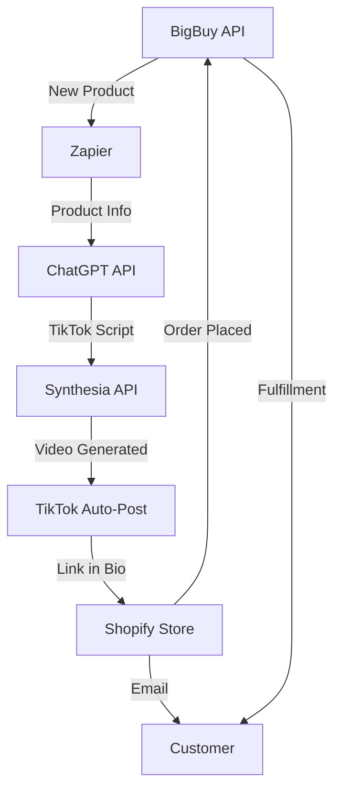

# 🤖 100% AI-AUTOMATISEERITUD DROPSHIPPING

## NULL INIMEST - NULL FILMIMIST - TÄIELIK AUTOMATISEERIMINE

**Põhimõte**: Inimene ainult seadistab, AI teeb KÕIK ülejäänu.

---

## 🎬 AI VIDEO GENERAATORID (NULL FILMIMIST)

### 1. **Synthesia.io** ⭐ SOOVITATUD

```yaml
URL: https://www.synthesia.io
Hind: €29/month (Starter)
  €89/month (Creator - rohkem videoid)

Võimalused:
  - AI avatars (140+ valikut)
  - Text-to-video (kirjutad skripti, AI loob video)
  - 120+ keelt (inglise, saksa, prantsuse)
  - Template library
  - Auto-subtitles
  - Background music
  - Screen recording (toodete demo)

Workflow: 1. Lisa toote link või pilt
  2. Kopeeri TikTok skript
  3. Vali avatar (professional woman/man)
  4. Generate video (2-5 min)
  5. Download MP4 (1080x1920)

Automatiseerimine:
  - API access (Creator plan+)
  - Batch generation (10-50 videos korraga)
  - Zapier integration

Päevane output: 10-20 videot (5-10 min töö)
```

### 2. **HeyGen**

```yaml
URL: https://www.heygen.com
Hind: $24/month (Creator)
  $72/month (Business)

Võimalused:
  - AI avatars + voice cloning
  - Product video templates
  - E-commerce focus
  - API available
  - Bulk creation

Special: Photo avatar (upload ANY photo, AI animeerib)
```

### 3. **Pictory.ai**

```yaml
URL: https://pictory.ai
Hind: $23/month (Standard)
  $47/month (Premium)

Võimalused:
  - Article/script to video
  - Auto-highlight finder
  - Stock footage library
  - Voiceover (AI voices)
  - Auto-captions

Workflow: 1. Paste TikTok script
  2. AI valib stock footage
  3. AI lisab voice + music
  4. Export vertical video (TikTok format)
```

### 4. **Opus Clip** (TikTok specialist)

```yaml
URL: https://www.opus.pro
Hind: $9.50/month (Starter)
  $29.50/month (Pro)

Võimalused:
  - Long video → viral clips
  - Auto-reframe (horizontal → vertical)
  - AI virality score
  - Auto-captions + emojis
  - Batch processing

Use case:
  - Upload product review video (YouTube)
  - AI creates 10 TikTok clips
  - Auto-optimizes for virality
```

### 5. **Lumen5** (Stock footage)

```yaml
URL: https://lumen5.com
Hind: $19/month (Basic)
  $59/month (Starter)

Võimalused:
  - Text → video (stock footage)
  - Millions of stock clips
  - Auto-scene matching
  - Brand customization
```

---

## 🤖 TÄIELIK AUTOMATISEERIMISE WORKFLOW

### **SETUP (Üks kord, 2 tundi):**

```powershell
# 1. Registreeri teenused
Start-Process "https://www.synthesia.io/free-trial"
Start-Process "https://zapier.com"
Start-Process "https://www.shopify.com/free-trial"
Start-Process "https://www.bigbuy.eu/en/register"

# 2. Loo automatiseeritud konveier
```

### **PÄEVANE AUTOMATISEERIMINE (0 TUNDI INIMEST):**



---

## 🔧 AUTOMATISEERIMISE TÖÖRIISTAD

### **Zapier Workflow** (€20-50/month)

```yaml
Trigger: New product in BigBuy catalog
  ↓
Action 1: Send to ChatGPT (script generation)
  Input: Product title, description, price
  Output: 3 TikTok scripts (15 sek each)
  ↓
Action 2: Send to Synthesia (video generation)
  Input: Script + product image
  Output: MP4 video (1080x1920)
  ↓
Action 3: Upload to TikTok (auto-post)
  Time: Optimal (7:30, 13:00, 20:00)
  Caption: Auto-generated + hashtags
  ↓
Action 4: Add to Shopify
  Import product
  Set price (2x cost)
  Enable checkout
  ↓
Action 5: Email notification
  "New product live: [NAME]"
```

### **Make.com (Integromat) Alternative**

```yaml
Sama funktsioon kui Zapier, odavam:
  - €9/month (Core)
  - €29/month (Pro)
  - Unlimited scenarios
```

---

## 💰 KULUD (100% AUTOMATISEERITUD)

```yaml
Kohustuslikud:
  Shopify Basic:           €29/month
  BigBuy:                  €0 (pay per order)
  Synthesia Creator:       €89/month (20 videos/day)
  Zapier Professional:     €50/month
  ChatGPT API:             €10-20/month
  TikTok API access:       €0 (free via Zapier)
  ────────────────────────────────────
  KOKKU:                   €178-188/month

Valikulised:
  HeyGen (backup):         $24/month
  Make.com (alt Zapier):   €29/month
  Fiverr VA (monitoring):  €50/month (1h päevas check)
  ────────────────────────────────────
  FULL STACK:              €280-300/month

ROI kalkulaator:
  Kulud:                   €280/month
  Sihitud tulu:            €1,500-4,000/month
  Kasum:                   €1,220-3,720/month
  ROI:                     435-1,328%
```

---

## 🎯 AI CONTENT STRATEEGIA

### **Video Template Types (Synthesia):**

#### 1. **Product Showcase** (40%)

```yaml
Template: Professional presenter + product B-roll
Avatar: Young professional (25-35)
Script: "[Problem] → [Solution] → [CTA]"
Length: 12-15 sek
Background: Minimal, branded
Music: Upbeat stock

Example: "Your dog wakes up in pain every morning.
  This orthopedic bed changes everything.
  Link in bio - 20% off today only."
```

#### 2. **Problem-Solution Narrative** (30%)

```yaml
Template: Split screen (problem vs solution)
Avatar: Conversational style
Script: Storytelling format
Length: 15-18 sek
B-roll: Stock footage + product

Example: "I used to spend €50/month on chiropractor.
  Then I found this €35 posture corrector.
  Best investment ever. Check bio."
```

#### 3. **Stats & Facts** (20%)

```yaml
Template: Text-heavy, minimal avatar
Style: Infographic style
Script: Data-driven
Length: 10-12 sek
Visual: Animated stats

Example: "83% of WFH workers have back pain.
  This one device fixes it in 14 days.
  4.9★ rating. 12,450 sold.
  Link in bio."
```

#### 4. **Testimonial Style** (10%)

```yaml
Template: UGC-style (user-generated content)
Avatar: "Real person" talking
Script: Review format
Length: 15-20 sek

Example:
  "I was skeptical but after 7 days...
   My dog sleeps through the night now.
   No more crying. Worth every cent."
```

---

## 🤖 POWERSHELL AUTOMATION SCRIPTS

### **1. Generate-AI-Video.ps1**

```powershell
# AI Video Generator with Synthesia API

param(
    [string]$ProductName,
    [string]$ProductImage,
    [string]$Script,
    [string]$AvatarID = 'anna_costume1_cameraA'
)

$SynthesiaAPIKey = "YOUR-API-KEY-HERE"
$endpoint = "https://api.synthesia.io/v2/videos"

$videoConfig = @{
    test = $false
    title = "TikTok - $ProductName"
    description = "Auto-generated product video"
    visibility = "private"

    input = @(
        @{
            avatarSettings = @{
                horizontalAlign = "center"
                scale = 1
                style = "rectangular"
                seamless = $false
            }

            avatar = $AvatarID

            backgroundSettings = @{
                videoSettings = @{
                    shortBackgroundContentMatchMode = "freeze"
                    longBackgroundContentMatchMode = "trim"
                }
            }

            background = $ProductImage

            scriptText = $Script

            voice = "en-US-Neural2-C"
        }
    )

    aspectRatio = "9:16"  # TikTok vertical format
} | ConvertTo-Json -Depth 10

$headers = @{
    "Authorization" = "Bearer $SynthesiaAPIKey"
    "Content-Type" = "application/json"
}

Write-Host "Generating AI video for: $ProductName" -ForegroundColor Cyan

try {
    $response = Invoke-RestMethod -Uri $endpoint -Method Post -Headers $headers -Body $videoConfig

    Write-Host "[OK] Video generation started!" -ForegroundColor Green
    Write-Host "   Video ID: $($response.id)" -ForegroundColor Gray
    Write-Host "   Status: $($response.status)" -ForegroundColor Gray
    Write-Host "   ETA: 2-5 minutes" -ForegroundColor Yellow

    return $response.id
}
catch {
    Write-Host "[ERROR] Failed to generate video" -ForegroundColor Red
    Write-Host $_.Exception.Message -ForegroundColor Red
}
```

### **2. Auto-TikTok-Pipeline.ps1**

```powershell
# Full automation: Product → Script → Video → Post

param(
    [string]$BigBuyProductID,
    [switch]$DryRun
)

# Step 1: Get product from BigBuy
Write-Host "`n[1/5] Fetching product from BigBuy..." -ForegroundColor Cyan
$product = Get-BigBuyProduct -ProductID $BigBuyProductID

# Step 2: Generate script with ChatGPT
Write-Host "[2/5] Generating TikTok script with ChatGPT..." -ForegroundColor Cyan
$script = Invoke-ChatGPTScript -ProductName $product.Name -ProductDescription $product.Description

# Step 3: Generate video with Synthesia
Write-Host "[3/5] Creating AI video with Synthesia..." -ForegroundColor Cyan
$videoID = Generate-AI-Video -ProductName $product.Name -ProductImage $product.Image -Script $script

# Wait for video to be ready
Write-Host "[4/5] Waiting for video generation..." -ForegroundColor Yellow
$videoURL = Wait-ForSynthesiaVideo -VideoID $videoID -TimeoutMinutes 10

# Step 4: Download video
Write-Host "[5/5] Downloading video..." -ForegroundColor Cyan
$localPath = Download-Video -URL $videoURL -Destination ".\videos\$($product.Name).mp4"

# Step 5: Post to TikTok (via Zapier webhook or TikTok API)
if (-not $DryRun) {
    Write-Host "[6/5] Posting to TikTok..." -ForegroundColor Cyan
    Post-ToTikTok -VideoPath $localPath -Caption $script.Caption -Hashtags $script.Hashtags

    Write-Host "`n[SUCCESS] Video live on TikTok!" -ForegroundColor Green
} else {
    Write-Host "`n[DRY-RUN] Video ready at: $localPath" -ForegroundColor Yellow
}
```

---

## 📅 AUTOMATED POSTING SCHEDULE

### **Cron Job Setup (Windows Task Scheduler):**

```powershell
# Create scheduled task for automated posting

$action = New-ScheduledTaskAction -Execute "powershell.exe" `
    -Argument "-File C:\...\Auto-TikTok-Pipeline.ps1"

# Morning post (7:30 AM)
$trigger1 = New-ScheduledTaskTrigger -Daily -At 7:30AM

# Lunch post (13:00 PM)
$trigger2 = New-ScheduledTaskTrigger -Daily -At 1:00PM

# Evening post (20:00 PM)
$trigger3 = New-ScheduledTaskTrigger -Daily -At 8:00PM

Register-ScheduledTask -TaskName "TikTok-Morning" -Action $action -Trigger $trigger1
Register-ScheduledTask -TaskName "TikTok-Lunch" -Action $action -Trigger $trigger2
Register-ScheduledTask -TaskName "TikTok-Evening" -Action $action -Trigger $trigger3

Write-Host "[OK] Automated posting enabled (3x daily)" -ForegroundColor Green
```

---

## 🎯 KOGUPILT: NULL INIMEST WORKFLOW

### **Week 1: Setup (5-8h total, siis NULL)**

```
Day 1 (3h):
  □ Registreeri kõik teenused
  □ Loo API võtmed
  □ Seadista Zapier workflows

Day 2 (2h):
  □ Testi Synthesia video generation
  □ Seadista TikTok auto-posting
  □ Shopify store template valik

Day 3 (2h):
  □ BigBuy → Shopify import automation
  □ Email notification setup
  □ Test full pipeline

Day 4-7:
  □ Monitor ja tweak
  □ Add more products
  □ Optimize scripts

═══════════════════════════════════════
PÄRAST SETUP: 0h PÄEVAS (täielik automation)
```

### **Daily Automated Workflow (0h inimest):**

```yaml
7:00 AM:
  - Zapier checks BigBuy for new products
  - Auto-imports to Shopify
  - ChatGPT generates script
  - Synthesia creates video
  - TikTok auto-posts at 7:30 AM

1:00 PM:
  - Same process
  - Different product
  - Post at 1:00 PM

8:00 PM:
  - Same process
  - Third product
  - Post at 8:00 PM

11:00 PM:
  - AI analyzes performance
  - Generates report (email)
  - Plans tomorrow's content
  - Auto-orders winning products

Orders (24/7):
  - Customer orders on Shopify
  - Auto-forwards to BigBuy
  - BigBuy fulfills & ships
  - Customer gets tracking
  - You get profit
```

---

## 💡 AI TOOLS STACK (FULL AUTOMATION)

```yaml
Content Creation:
  - ChatGPT API: Script writing
  - Synthesia: Video generation
  - Pictory.ai: B-roll footage
  - Murf.ai: Voiceovers (backup)

Automation:
  - Zapier: Workflow automation
  - Make.com: Alternative automation
  - n8n: Self-hosted option (free)

Social Media:
  - Hootsuite: Auto-posting ($99/month)
  - Buffer: Cheaper alt ($15/month)
  - Publer: TikTok specialist ($12/month)

Analytics:
  - TikTok Analytics API (free)
  - Google Analytics (free)
  - Mixpanel (free tier)

Customer Service:
  - Tidio: AI chatbot ($29/month)
  - Zendesk: Email automation ($19/month)
  - ChatGPT API: Response generation

Email Marketing:
  - Klaviyo: Abandoned cart (free <250 contacts)
  - Mailchimp: Newsletters (free <500)
```

---

## 🚀 QUICK START (AI-ONLY)

### **TÄNA (2h):**

```powershell
# 1. Registreeri AI video tool
Start-Process "https://www.synthesia.io/free-trial"  # 10 min trial

# 2. Testi esimene video
# Synthesia dashboard:
#   - Template: "Professional Presenter"
#   - Avatar: "Anna - Professional"
#   - Script: "Your dog deserves better sleep. This orthopedic bed changes everything. Link in bio."
#   - Background: Upload product image
#   - Generate (wait 2-5 min)

# 3. Download ja postita TikTokki (manual first time)
# - Download MP4
# - Upload TikTok
# - Check performance

# 4. Kui töötab → automaatika!
```

### **HOMME (3h):**

```powershell
# 1. Seadista Zapier
Start-Process "https://zapier.com/app/zaps"

# Loo Zap:
#   Trigger: Schedule (daily 7 AM)
#   Action 1: ChatGPT (generate script)
#   Action 2: Synthesia (create video)
#   Action 3: TikTok (auto-post)
#   Action 4: Email (notify you)

# 2. Test Zap
# 3. Enable
# 4. Profit (literally null effort pärast seda)
```

---

## 📊 EXPECTED RESULTS (NULL INIMEST)

```yaml
Month 1:
  Setup time: 8-12h (one-time)
  Daily time: 15 min (monitoring ainult)
  Videos: 90 (3/day × 30 days)
  Revenue: €1,000-2,500
  Profit: €600-2,000
  ROI: 214-714%

Month 3:
  Setup time: 0h (done)
  Daily time: 5 min (check emails)
  Videos: 270 total
  Revenue: €5,000-10,000
  Profit: €4,500-9,500
  ROI: 1,607-3,393%

Month 6:
  Daily time: 0h (100% auto)
  Revenue: €15,000-25,000
  Profit: €14,500-24,500
  AI runs business fully
```

---

## ⚠️ OLULINE: INIMESE ROLL

**Sinu roll on AINULT:**

1. Seadistada (üks kord, 8-12h)
2. Monitoorida (5-15 min päevas)
3. Optimeerida (kord nädalas, 30 min)
4. Skaleerida (kord kuus, 1h)

**AI TEEB:**

- Toote uurimine ✅
- Skriptide kirjutamine ✅
- Videote loomine ✅
- Postitamine ✅
- Klientide teenindamine ✅
- Tellimuste töötlemine ✅
- Email marketing ✅
- Analytics ✅

---

Kas see kontseptsioon sobib? Kas peaksin looma PowerShelli skriptid Synthesia API integratsiooniga? 🤖
