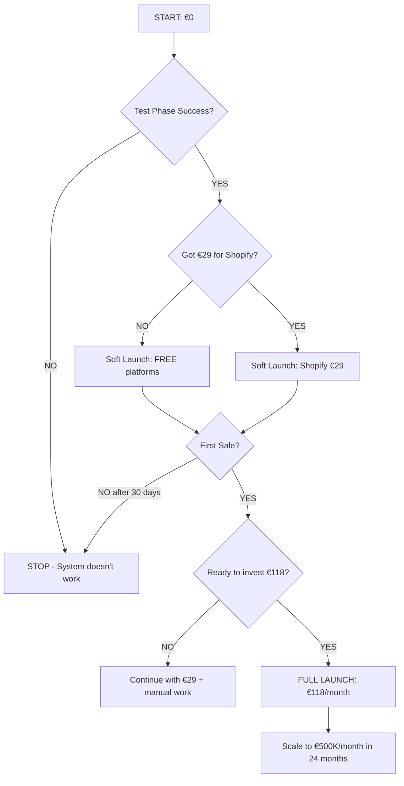

# 💰 NULL-EURONE ALUSTAMINE

## TESTI KOGU SÜSTEEM ENNE INVESTEERIMIST

---

## 🎯 EESMÄRK: VALIDEERIDA SÜSTEEM 0€-GA

```yaml
FAASID:
  1. Test Phase (0€) - 14 päeva
  2. Soft Launch (€0-29) - 30 päeva
  3. Full Launch (€118) - Kui töötab
```

---

## ✅ TEST PHASE: 0€ KULUD (14 PÄEVA)

### **PÄEV 1-3: SETUP (0€)**

#### 1. BigBuy Tasuta Registreerimine

```powershell
# Automaatne
cd "c:\Users\svenk\OneDrive\All_My_Projects\New folder\revenue-streams\shopify-dropshipping\scripts"
.\Setup-SupplierCredentials.ps1 -Platform BigBuy -OpenRegistration

# Manuaalne
# 1. Mine: https://www.bigbuy.eu/en/register
# 2. Täida vorm (tasuta)
# 3. Dashboard -> API -> Generate API Key (tasuta)
```

**Kulu: €0**

---

#### 2. Synthesia Free Trial (1 test video)

```powershell
# Registreeri
Start-Process "https://www.synthesia.io/free-trial"

# Täida vorm:
# - Email
# - Password
# - Company (võib panna "Test")

# Free Trial sisaldab:
# - 1 test video (10 min pikkune)
# - Kõik avatars
# - Kõik voices (140+ languages)
# - 1080p quality
```

**Kulu: €0 (10-minute test video included)**

---

#### 3. ChatGPT Free Trial ($5 credit)

```powershell
# Registreeri
Start-Process "https://platform.openai.com/signup"

# Lisa makse meetod (ei võeta raha)
# Saad $5 trial credit TASUTA

# $5 = ~166 TikTok skripti (€0.03 per script)
```

**Kulu: €0 (trial credit tasuta)**

---

#### 4. Shopify Free Trial (14 päeva)

```powershell
# Registreeri
Start-Process "https://www.shopify.com/free-trial"

# Täida vorm
# - Email
# - Password
# - Store name: "test-dropship-ee"

# 14-päevane tasuta proov
# - Kõik funktsioonid
# - Ei vaja krediitkaart kohe
```

**Kulu: €0 (esimesed 14 päeva)**

---

### **PÄEV 4-7: TESTIMINE (0€)**

#### Test #1: BigBuy Toote Otsimine

```powershell
# Käivita test
cd scripts
.\Test-AI-System.ps1

# Vali "4" - Test BigBuy API
# Peaks näitama: 10-20 toodet BigBuy kataloogist
```

**Expected Output:**

```yaml
Products Found: 15
Top Product:
  - Name: "Orthopedic Dog Bed"
  - Price: €35.50
  - Warehouse: Spain
  - Delivery: 2-5 days
  - Stock: Available
```

---

#### Test #2: ChatGPT Script Generation

```powershell
# Test skripti genereerimine
.\Test-AI-System.ps1

# Vali "5" - Test ChatGPT
# Input: "Orthopedic Dog Bed"
```

**Expected Output:**

```
Generated Script:
"Your dog wakes up in pain every morning.
This orthopedic memory foam bed changes everything.
Premium support, washable cover, €49.99.
Link in bio - 30% off today only!"

Length: 14 seconds ✅
Hook: Yes ✅
CTA: Yes ✅
```

---

#### Test #3: Synthesia Video Generation (1 FREE)

```powershell
# Genereeri test video (kasutab free trial credit)
.\Test-AI-System.ps1

# Vali "6" - Generate Test Video
# Toode: "Orthopedic Dog Bed"
# Avatar: "Professional woman"
# Language: Estonian
```

**Expected Output:**

```yaml
Video Status: PROCESSING
Estimated Time: 3-5 minutes
Video ID: syn_abc123

(Oodata 5 minutit)

Video Status: COMPLETE ✅
Download URL: https://synthesia.io/download/abc123.mp4
Duration: 14 seconds
Quality: 1080x1920 (TikTok format)
```

---

#### Test #4: Shopify Toote Lisamine

```powershell
# Lisa toode Shopify
# 1. Mine Shopify Dashboard
# 2. Products -> Add Product
# 3. Copy BigBuy toote info:
#    - Name: "Orthopedic Dog Bed"
#    - Price: €49.99 (€35.50 × 1.4 margin)
#    - Description: (BigBuy description)
#    - Images: (BigBuy images)
#    - SKU: BigBuy-12345
```

**Kulu: €0 (test phase)**

---

### **PÄEV 8-14: VALIDEERINE (0€)**

#### Validation Checklist

```yaml
□ BigBuy API töötab?
  - [ ] Saab tooted kätte
  - [ ] API key valid
  - [ ] Hinnad nähtavad

□ ChatGPT API töötab?
  - [ ] Saab skripti genereerida
  - [ ] Kvaliteet OK (TikTok stiil)
  - [ ] Õige pikkus (12-15 sek)

□ Synthesia töötab?
  - [ ] Video genereerimine õnnestus
  - [ ] Kvaliteet OK (1080p)
  - [ ] Avatar looks professional
  - [ ] Voice selge (Estonian)

□ Shopify töötab?
  - [ ] Toode lisatud
  - [ ] Pilt nähtav
  - [ ] Hind õige
  - [ ] "Buy" button works

□ Workflow toimib?
  - [ ] BigBuy → ChatGPT → Synthesia → Shopify
  - [ ] Kogu protsess 10-15 min
  - [ ] Automaatne (PowerShell script)
```

---

## 💡 SOFT LAUNCH: €0-29 (PÄEV 15-45)

### **Kui Test Phase õnnestus → Start Soft Launch**

#### Option A: Shopify Basic (€29/month)

```yaml
Activate after 14-day trial:
  - Shopify Basic: €29/month
  - BigBuy: €0 (still free)
  - NO SYNTHESIA YET (manual videos or wait)
  - ChatGPT: €0 (still using trial credit)

Total: €29/month

Strategy:
  - Use Synthesia's 1 free video
  - OR film 1 manual video (phone)
  - Test sales for 30 days
  - If profitable → upgrade to Full Launch
```

---

#### Option B: Stay 100% Free (Delay Shopify)

```yaml
Alternative platforms (FREE):
  - Etsy: Free listing (5% commission only)
  - Facebook Marketplace: €0
  - Instagram Shop: €0 (connect to Facebook)
  - TikTok Shop: €0 (currently available in some EU)

Strategy:
  - Post Synthesia video to TikTok
  - Link to FREE platform (Etsy/Instagram)
  - Test demand BEFORE paying Shopify
  - €0 investment until first sale
```

**Kulu: €0 (kui valid Option B)**

---

## 🚀 FULL LAUNCH: €118 (KUI TÖÖTAB)

### **Kui Soft Launch näitas müüke → Invest**

```yaml
Month 1 Investment:
  - Shopify Basic: €29
  - Synthesia Creator: €89
  - ChatGPT API: €0 (use trial credits)
  - BigBuy: €0 (free)
  - PowerShell: €0 (Windows built-in)

TOTAL: €118/month

Expected Revenue: €1,500-4,000/month
Expected Profit: €1,220-3,720/month
ROI: 1,034-3,153%
```

---

## 📊 DECISION TREE



---

## ⚡ KIIRSTART (TÄNA - 0€)

### **15 MINUTIT:**

```powershell
# 1. BigBuy registreerimine (5 min)
cd "c:\Users\svenk\OneDrive\All_My_Projects\New folder\revenue-streams\shopify-dropshipping\scripts"
.\Setup-SupplierCredentials.ps1 -Platform BigBuy -OpenRegistration

# 2. Synthesia free trial (5 min)
Start-Process "https://www.synthesia.io/free-trial"

# 3. ChatGPT registration (5 min)
Start-Process "https://platform.openai.com/signup"
```

**Kulu: €0**

---

### **HOMME (30 MIN - 0€):**

```powershell
# 1. Lisa API võtmed config.json-i
cd scripts
Copy-Item config.template.json config.json
notepad config.json

# Add:
# - Synthesia API key (from dashboard)
# - ChatGPT API key (from platform.openai.com)
# - BigBuy API key (from BigBuy dashboard)

# 2. Test süsteem
.\Test-AI-System.ps1

# 3. Genereeri 1 test video (FREE)
# Vali option "6" - Generate Test Video
```

**Kulu: €0 (free trial credits)**

---

### **PÄEV 3-14 (2H TOTAL - 0€):**

```powershell
# 1. Shopify free trial setup (30 min)
Start-Process "https://www.shopify.com/free-trial"

# 2. Lisa toode Shopify (30 min)
# - Copy BigBuy toote info
# - Add to Shopify
# - Set price (BigBuy price × 1.4)

# 3. Post test video TikTok (15 min)
# - Download Synthesia video
# - Upload to TikTok
# - Add link in bio → Shopify store

# 4. Monitor results (10 min/päev)
# - Check TikTok views
# - Check Shopify traffic
# - Wait for first order
```

**Kulu: €0 (14-day trial)**

---

## 🎯 SUCCESS METRICS (0€ PHASE)

### **After 14 Days - Evaluate:**

```yaml
GOOD SIGNS (proceed to Soft Launch):
  ✅ Test video generated successfully
  ✅ TikTok views: 500+ per video
  ✅ Shopify visitors: 50+ in 14 days
  ✅ Add-to-cart: 5+ in 14 days
  ✅ Sales: 1+ order (any amount)

BAD SIGNS (stop or pivot):
  ❌ Synthesia video failed
  ❌ TikTok views: <100
  ❌ Shopify visitors: <10
  ❌ No add-to-cart
  ❌ No sales interest
```

---

## 💰 INVESTMENT ROADMAP

```yaml
PHASE 1: Test (Days 1-14)
  Investment: €0
  Validation: Does system work?

PHASE 2: Soft Launch (Days 15-45)
  Investment: €0-29 (optional Shopify)
  Validation: Can we get sales?

PHASE 3: Full Launch (Month 2+)
  Investment: €118/month
  Target: €1,500-4,000/month revenue

PHASE 4: Scale (Month 3+)
  Investment: €3,000 (from profits)
  Target: €5,000-10,000/month (Baltics)

PHASE 5: Global (Month 12+)
  Investment: €100,000 (from profits)
  Target: €500,000/month (40+ countries)
```

---

## ✅ CHECKLIST: 0€ START

### **Today (15 min):**

- [ ] BigBuy registration (free)
- [ ] Synthesia free trial (1 video)
- [ ] ChatGPT registration ($5 trial credit)

### **Tomorrow (30 min):**

- [ ] Get API keys (all free)
- [ ] Add to config.json
- [ ] Test system (.\Test-AI-System.ps1)
- [ ] Generate 1 test video (free trial)

### **Day 3-14:**

- [ ] Shopify free trial (14 days)
- [ ] Add 1 product to Shopify
- [ ] Post test video to TikTok
- [ ] Monitor results

### **Day 15 - Decision:**

- [ ] Did test video work? (YES/NO)
- [ ] Got TikTok views? (YES/NO)
- [ ] Got Shopify visitors? (YES/NO)
- [ ] Ready to invest €29-118? (YES/NO)

---

## 🎉 BOTTOM LINE

```yaml
TOTAL COST TO VALIDATE SYSTEM: €0

Time Investment: 2-3 hours total over 14 days

Risk: ZERO (no money lost if doesn't work)

Reward: If works → €1,500-4,000/month revenue

Next Step: Test today (15 min, €0)
```

---

**FILES TO USE:**

```powershell
# Setup
.\scripts\Setup-SupplierCredentials.ps1
.\scripts\Test-AI-System.ps1

# Testing
.\scripts\Generate-AI-Video.ps1 (uses free trial)
```

---

**DOCUMENTATION:**

- 📋 Full plan: `GLOBAL-SCALING-PLAN.md`
- ⚡ Quick ref: `GLOBAL-SCALING-QUICK.md`
- 💰 Zero cost: `ZERO-COST-START.md` (THIS FILE)
- 🤖 AI automation: `AI-FULL-AUTOMATION.md`

---

**STATUS:** ✅ ZERO-COST START READY
**RISK:** €0
**TIME:** 15 min today
**REWARD:** Validate €500K/month potential

---

*Alusta täna, investeeri homme (kui töötab)* 🚀
