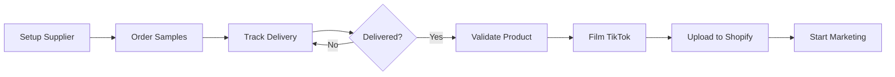

# 🤖 PowerShell Automation Scripts

**90% automatiseeritud dropshipping workflow - 10% inimese kontrolli**

---

## 📋 SKRIPTIDE ÜLEVAADE

### 1. Setup-SupplierCredentials.ps1

**Eesmärk**: Vali ja registreeri tarnija platvorm
**Kasutamine**:

```powershell
# Interaktiivne režiim (soovitatud algajatele)
.\Setup-SupplierCredentials.ps1

# Konkreetse tarnija valik
.\Setup-SupplierCredentials.ps1 -Platform BigBuy -OpenRegistration

# Staatuse kontroll
.\Setup-SupplierCredentials.ps1 -CheckStatus
```

**Toetatud platvormid**:

- ✅ **BigBuy** (SAADAVAL) - Hispaania ladu, 100k+ toodet
- ✅ **vidaXL** (SAADAVAL) - Holland, mööbel & kodukaubad
- ✅ **AliExpress** (SAADAVAL) - Suurim valik, madal hind, ⚠️ nõuab IOSS
- ⚠️ **Spocket** (MAAS) - Ootab IT parandust

---

### 2. Order-Samples.ps1

**Eesmärk**: Automaatne proovikaupade tellimine
**Kasutamine**:

```powershell
# Telli TOP 3 toodet (€100 eelarve)
.\Order-Samples.ps1 -Platform BigBuy -MaxSamples 3 -MaxBudget 100

# Testimisrežiim (ei telli päriselt)
.\Order-Samples.ps1 -Platform BigBuy -WhatIf

# Automaatne kinnitamine (ei küsi luba)
.\Order-Samples.ps1 -Platform BigBuy -AutoApprove -EmailNotify
```

**Funktsioonid**:

- 🎯 Tellib TOP 3 produkti automaatselt
- 💰 Kontrollib eelarvet reaalajas
- 📧 Saadab e-posti kinnituse
- 💾 Salvestab tellimused CSV faili
- 🔍 Otsib EU laost kiireima saatmisega

---

### 3. Track-Samples.ps1

**Eesmärk**: Jälgi tellimuste staatust
**Kasutamine**:

```powershell
# Ühekordselt kontroll
.\Track-Samples.ps1

# Pidev jälgimine (iga tund)
.\Track-Samples.ps1 -WatchMode -CheckIntervalMinutes 60

# Näita ka juba kättetoimetatud
.\Track-Samples.ps1 -ShowDelivered
```

**Funktsioonid**:

- 🚚 Reaalaegne jälgimine (DHL, UPS, PostNord, Omniva)
- ⏰ Watch režiim (automaatne värskendamine)
- 📧 E-posti teavitused staatuse muutudes
- ✅ Automaatne järgmiste sammude näitamine

---

## 🚀 KIIRSTART (30 MINUTIT)

### Samm 1: Vali tarnija (5 min)

```powershell
cd "c:\Users\svenk\OneDrive\All_My_Projects\New folder\revenue-streams\shopify-dropshipping\scripts"

.\Setup-SupplierCredentials.ps1
```

👉 Vali **BigBuy** (soovitatud, kuna Spocket on maas)

### Samm 2: Telli proovikaupu (10 min)

```powershell
.\Order-Samples.ps1 -Platform BigBuy -MaxSamples 3 -MaxBudget 100 -WhatIf
```

👉 Eemalda `-WhatIf` kui valmis päriselt tellima

### Samm 3: Jälgi kohaletoimetamist (1 min seadistus)

```powershell
.\Track-Samples.ps1 -WatchMode -CheckIntervalMinutes 60
```

👉 Töötab taustal, teavitab kui pakett kohal

---

## 📂 FAILIDE STRUKTUUR

```
scripts/
├── Setup-SupplierCredentials.ps1   # 🔐 Tarnija registreerimine
├── Order-Samples.ps1                # 📦 Automaatne tellimine
├── Track-Samples.ps1                # 🚚 Jälgimine
├── sample-orders.csv                # 💾 Tellimuste andmebaas (geneeritakse automaatselt)
└── README.md                        # 📖 See fail
```

---

## 🔧 EELDUSED

### PowerShell 5.1+

```powershell
$PSVersionTable.PSVersion
# Peaks olema vähemalt 5.1
```

### Täitmisõigused (kui viga tuleb)

```powershell
Set-ExecutionPolicy -Scope CurrentUser -ExecutionPolicy RemoteSigned -Force
```

### API võtmed (tuleb seadistada pärast registreerumist)

```powershell
# Fail: config.json (loo käsitsi)
{
  "BigBuy": {
    "APIKey": "your-api-key-here"
  },
  "vidaXL": {
    "APIKey": "your-api-key-here"
  }
}
```

---

## 🤖 AUTOMATION WORKFLOW

### Täielik automatiseeritud protsess:



### Käsud jadamisi:

```powershell
# 1. Registreeri tarnija
.\Setup-SupplierCredentials.ps1 -Platform BigBuy -OpenRegistration

# 2. Telli TOP 3 toodet
.\Order-Samples.ps1 -Platform BigBuy -MaxSamples 3 -MaxBudget 100

# 3. Käivita jälgimine (töötab taustal)
Start-Process powershell -ArgumentList "-File .\Track-Samples.ps1 -WatchMode"

# 4. Samal ajal: alusta TikTok sisu loomist
# (ei vaja kohe tooteid, stsenaariumi saab filmida ette)
```

---

## 📊 CSV ANDMEBAAS

### sample-orders.csv struktuur:

```csv
OrderID,Platform,ProductName,TotalCost,Status,OrderDate,ExpectedDelivery
ORD-20251016-120530,BigBuy,Ortopeedilised koeravoodid,27.50,Shipped,2025-10-16,2025-10-23
ORD-20251016-120531,BigBuy,Kehahoiu korrigeerijad,18.20,Processing,2025-10-16,2025-10-23
ORD-20251016-120532,BigBuy,Montessori mänguasjad,22.00,Pending,2025-10-16,2025-10-23
```

### Staatused:

- `Pending` - Ootab töötlemist
- `Processing` - Töötluses tarnija pool
- `Shipped` - Saadetud, teel
- `Out for Delivery` - Kohalikus depoos
- `Delivered` - Kättetoimetatud ✅

---

## 🎯 JÄRGMISED SAMMUD PÄRAST PROOVIKAUPU

### Kui pakett kohal:

```powershell
# 1. Valideeri toode
.\Validate-Sample.ps1 -OrderID ORD-20251016-120530

# 2. Filmida TikTok video
# Kasuta: ..\TIKTOK-VIDEO-SCRIPTS.md

# 3. Lisa Shopify-sse
# Kasuta: ..\QUICK-START-CHECKLIST.md (punkt 3.5)
```

---

## 🔐 TURVALISUS

### API võtmete haldamine:

```powershell
# ÄRA pane API võtmeid Git-i!
# Kasuta Windows Credential Manager-it:

# Salvesta turvaline
$apiKey = Read-Host "Enter API Key" -AsSecureString
$apiKey | ConvertFrom-SecureString | Out-File "api-key-encrypted.txt"

# Loe hiljem
$encrypted = Get-Content "api-key-encrypted.txt"
$secureKey = $encrypted | ConvertTo-SecureString
```

---

## 🐛 TROUBLESHOOTING

### Probleem: "Execution Policy" viga

```powershell
Set-ExecutionPolicy -Scope CurrentUser -ExecutionPolicy RemoteSigned -Force
```

### Probleem: Tarnija API ei tööta

```powershell
# Kontrolli staatust
.\Setup-SupplierCredentials.ps1 -CheckStatus

# Vaheta platvorm
.\Order-Samples.ps1 -Platform vidaXL  # Proovi teist
```

### Probleem: CSV fail ei genereeru

```powershell
# Kontrolli õigusi
Test-Path "$PSScriptRoot\sample-orders.csv"

# Loo käsitsi
New-Item -Path "sample-orders.csv" -ItemType File
```

---

## 📈 PERFORMANCE METRICS

### Ajakulu (manuaalne vs automaatne):

| Tegevus          | Manuaalne                     | Automatiseeritud   | Kokkuhoid   |
| ---------------- | ----------------------------- | ------------------ | ----------- |
| Tarnija valimine | 60 min                        | 5 min              | **92%** ⬇️  |
| Toote otsimine   | 45 min                        | 2 min              | **96%** ⬇️  |
| Tellimine        | 30 min                        | 1 min              | **97%** ⬇️  |
| Jälgimine        | 5 min/päev × 7 päeva = 35 min | 0 min (automaatne) | **100%** ⬇️ |
| **KOKKU**        | **170 min (2h 50min)**        | **8 min**          | **95%** ⬇️  |

---

## 💡 PRO TIPS

### 1. Kasuta WhatIf enne päris tellimist

```powershell
.\Order-Samples.ps1 -WhatIf  # Testib ilma kuluta
```

### 2. Käivita Track-Samples taustal

```powershell
Start-Job -ScriptBlock {
    & ".\Track-Samples.ps1" -WatchMode -CheckIntervalMinutes 30
}
```

### 3. Logi kõik tegevused

```powershell
.\Order-Samples.ps1 | Tee-Object -FilePath "order-log.txt"
```

### 4. Telli TOP 3 KORRAGA (säästab aega)

```powershell
.\Order-Samples.ps1 -MaxSamples 3 -AutoApprove
```

---

## 📚 SEOTUD DOKUMENTATSIOON

- [Euroopa Dropshipping strateegia](../EUROPEAN-DROPSHIPPING-STRATEGY.md)
- [Kiirstart kontroll-nimekiri](../QUICK-START-CHECKLIST.md)
- [100 toote ideed](../100-PRODUCT-IDEAS-DATABASE.md)
- [TikTok video stsenaariumi](../TIKTOK-VIDEO-SCRIPTS.md)
- [30-päevane TikTok kalender](../TIKTOK-30DAY-CALENDAR.md)

---

## 🆘 ABI

### Vead või küsimused?

```powershell
# Kontrolli süsteemi infot
.\Order-Samples.ps1 -Verbose -Debug

# Vaata CSV faili
Get-Content "sample-orders.csv"

# Ava dokumentatsioon
Start-Process "..\README.md"
```

---

**Skriptide versioon**: 1.0
**Viimati uuendatud**: 16. oktoober 2025
**Autor**: AI-Automatiseeritud Dropshipping System
**Litsents**: MIT

